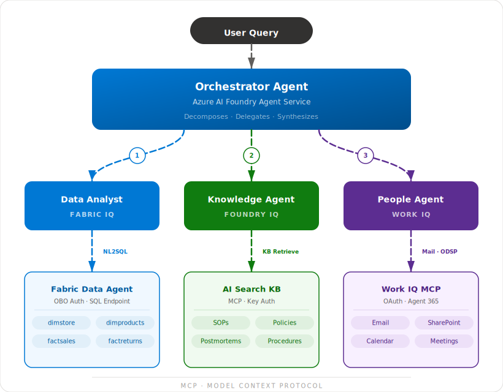

# Architecture

## Overview

The Enterprise Operations Advisor uses a **coordinator pattern**: an orchestrator agent decomposes user questions and delegates to three specialist agents, each grounded in a different IQ layer via MCP.

## Data Flow

1. **User** submits a natural-language question to `main.py`.
2. **Orchestrator** (Foundry Agent Service) analyzes the question and identifies which IQ layers are relevant.
3. **Specialist agents** run in sequence, each calling its MCP endpoint:
   - **Data Analyst** → Fabric Data Agent (via project connection, OBO auth) → NL2SQL → Lakehouse tables
   - **Knowledge Agent** → AI Search KB MCP → `knowledge_base_retrieve` → Document chunks with citations
   - **People Agent** → Work IQ MCP → Mail/SharePoint search → Relevant communications
4. **Orchestrator** receives all three responses and synthesizes a unified briefing with:
   - Data-backed metrics (sourced to Fabric IQ)
   - Relevant SOPs and past incidents (sourced to Foundry IQ)
   - Organizational context and recommended contacts (sourced to Work IQ)
   - Prioritized next steps with owners

## Tool Integration

Each specialist agent connects to its data source via a Foundry Agent Service tool:

- **Data Analyst** uses `MicrosoftFabricPreviewTool` with a Foundry project connection (identity passthrough / OBO auth). Service principal auth is not supported.
- **Knowledge Agent** uses `MCPTool` with `project_connection_id` for key-based auth to the AI Search Knowledge Base MCP endpoint.
- **People Agent** uses `MCPTool` with OAuth identity passthrough for Agent 365 MCP servers (Mail, SharePoint).

This means any MCP-compatible data source can be swapped in without changing agent logic — the protocol provides a standard interface across structured data, knowledge bases, and organizational context.

## Authentication

- **Azure Identity**: `DefaultAzureCredential` flows through to all Azure-hosted MCP endpoints.
- **Foundry Agent Service**: Authenticated via the project endpoint + credential.
- **Work IQ**: Requires Microsoft 365 Copilot license; auth is handled by the Work IQ MCP server after admin enablement.

## Why This Architecture?

| Design Choice | Rationale |
|---|---|
| **Specialist agents per IQ** | Each agent has focused instructions optimized for its data type |
| **Sequential delegation** | Simpler than parallel fan-out; easier to debug and trace |
| **MCP everywhere** | Standard protocol means agents are data-source agnostic |
| **Orchestrator synthesis** | Final response combines all layers with proper attribution |
